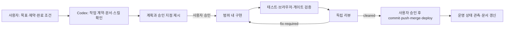

# Codex AI 자동 업무 관리 시스템 사용자 매뉴얼

> 대상: Codex로 opensamguk의 기획, 구현, 검증, 리뷰, 배포 준비 업무를 수행하는 사용자
> 기준일: 2026-07-17

이 매뉴얼은 사용자가 코드를 직접 세세하게 지시하기보다 **목표, 제약, 완료 조건, 승인 범위**를 정하고, Codex가 프로젝트의 규칙과 도구를 사용해 계획부터 검증까지 수행하도록 지휘하는 방법을 설명한다.

첨부된 4개 교육 문서의 방법론을 다음처럼 이 프로젝트에 적용했다.

- 단순 반복 업무의 **위임**에서 시작해, 함께 문제를 푸는 **협업**, 목표 중심의 **자동화**로 확장한다.
- 프로젝트 규칙과 현재 상태를 먼저 제공해 AI의 컨텍스트 부족을 줄인다.
- MCP와 CLI를 AI의 손발로 사용하되, 등록·인증·실호출 성공을 구분한다.
- 훅, 테스트, 독립 리뷰, CI/CD, 모니터링을 연결해 “작업했다”가 아니라 “증거로 확인했다”까지 닫는다.
- 아이디어를 작업 계약과 계획으로 구체화한 뒤 구현, 검증, 배포 준비, 운영 관측, 회고로 이어간다.

이 문서는 Claude Code 사용법을 그대로 옮긴 문서가 아니다. opensamguk에 실제로 설치된 Codex 표면인 `.codex/`, `.agents/skills/`, `scripts/agent/`, `docs/agent/`, `.ai/`를 기준으로 작성했다.

## 1. 사용자가 기억할 핵심 원칙

Codex를 “정답을 내는 마법 도구”가 아니라 **프로젝트 경험은 아직 부족하지만 도구를 사용할 수 있는 유능한 팀원**으로 대한다.

사용자가 맡을 일은 다음 네 가지다.

1. **무엇과 왜**: 해결할 문제와 사용자 가치를 정한다.
2. **경계**: 수정 가능한 범위, 금지 사항, 예산과 시간을 정한다.
3. **완료 기준**: 어떤 테스트와 관측이 있어야 끝인지 정한다.
4. **승인**: 의존성 추가, 외부 쓰기, 커밋, push, merge, 배포 같은 경계 행동을 승인한다.

Codex에 맡길 일은 다음과 같다.

1. 필요한 프로젝트 문서와 스킬 선택
2. 코드·문서·테스트 조사
3. 실행 가능한 계획 작성
4. 승인된 범위의 구현
5. 테스트와 브라우저 관측
6. 독립 리뷰와 수정 반복
7. 실행한 검증, 미실행 검증, 실패의 구분 보고

전체 흐름은 다음과 같다.



## 2. 처음 프로젝트를 열었을 때

### 2.1 프로젝트를 신뢰하고 다시 열기

Codex에서 이 저장소를 열고 프로젝트의 설정과 훅을 검토한 뒤 신뢰한다. 다음 파일이 프로젝트 단위 Codex 설정이다.

- `.codex/config.toml`: 프로젝트 에이전트와 MCP 선언
- `.codex/hooks.json`: 세션 시작, 파일 변경 전, 변경 후 훅
- `.codex/agents/*.toml`: 역할별 에이전트 설정
- `.agents/skills/`: 프로젝트 스킬 실행 표면

설정이나 훅을 새로 받았거나 수정했다면 Codex 프로젝트를 reload 또는 restart한다. 훅은 세션 시작 시 로드되므로 파일이 존재한다는 사실만으로 현재 세션에서 활성이라고 단정하지 않는다.

### 2.2 프로젝트 스킬 상태 확인

프로젝트를 열면 `SessionStart` 훅이 `skills-lock.json`을 기준으로 외부 skills.sh 스킬을 `.agents/skills/`에 복원하려고 시도한다. 네트워크가 없으면 복원이 보류될 수 있으므로 첫 작업 전에 다음처럼 확인한다.

```bash
scripts/agent/project-skills.sh status
```

누락이 있으면 수동 복원한다.

```bash
scripts/agent/project-skills.sh restore
```

정상 상태의 기준은 `Project skills ready.`이다. 외부 스킬 본문은 로컬 실행물이며 git에 커밋하지 않는다. 설치 목록과 해시는 `skills-lock.json`이 고정한다.

### 2.3 시작 상태를 Codex에게 확인시키기

첫 대화는 다음처럼 시작하면 된다.

```text
이 프로젝트의 Agent OS가 현재 세션에서 준비됐는지 확인해줘.
프로젝트 훅, skills-lock 기준 스킬 상태, 현재 브랜치와 작업 트리,
.ai/task.md의 현재 작업 계약을 읽고 실행 가능한 상태만 보고해.
등록만 된 MCP는 사용 가능하다고 단정하지 말고, 필요한 경우 실호출 확인 항목으로 분리해.
파일은 수정하지 마.
```

Codex가 기존 작업 트리의 변경을 발견하면 먼저 누구의 변경인지 구분해야 한다. 다른 작업이 진행 중인 파일을 덮어쓰거나 정리하도록 지시하지 않는다.

## 3. 좋은 업무 요청 작성법

막연한 요청보다 다음 여섯 항목을 포함한 요청이 안정적이다.

| 항목 | 사용자가 적을 내용 | 예시 |
| --- | --- | --- |
| 목표 | 최종적으로 달라져야 할 것 | 장수 로그 페이지의 월 필터 오류 수정 |
| 이유 | 사용자 또는 운영 가치 | 이전 달 로그가 섞여 관리자가 오판함 |
| 범위 | 수정 가능한 영역 | `app/game-api` read query와 관련 테스트 |
| 제약 | 절대 깨지면 안 되는 규칙 | API 응답 형식 유지, 기존 변경 보존 |
| 완료 조건 | 검증 가능한 기준 | 회귀 테스트, game-api 테스트 XML 0 failure |
| 승인 범위 | 외부 상태 변경 허용 여부 | 구현과 테스트만, commit/push 금지 |

복사해 사용할 수 있는 기본 양식은 다음과 같다.

```text
목표:
사용자 가치:
현재 증상 또는 근거:
수정 허용 범위:
금지 사항과 제약:
완료 조건:
실행해도 되는 외부 작업:
실행하면 안 되는 작업:
```

예를 들어 다음 요청은 계획과 검증 기준이 명확하다.

```text
목표: 관리자 장수 로그에서 선택한 연·월의 항목만 조회되게 수정해.
사용자 가치: 월 경계에서 다른 달 로그가 섞이는 오판을 막는다.
범위: game-api read repository와 관련 테스트, 필요한 Flyway 인덱스만.
제약: 현재 작업 트리의 다른 변경은 보존하고, API 응답 형식은 바꾸지 마.
완료 조건: 재현 테스트 추가, game-api와 infra 관련 테스트의 XML failures/errors 0.
승인 범위: 분석·구현·검증까지. commit, push, merge, deploy는 금지.
먼저 계획만 제시해.
```

## 4. 가장 권장하는 일상 업무 흐름

### 4.1 1단계: 계획만 받기 — `$os-start-task`

비자명한 기능, 버그, 문서 체계, 인프라 작업은 바로 구현시키지 않고 계획부터 받는다.

```text
$os-start-task
게임 내 외교 서신 목록의 읽지 않음 필터를 추가하려고 해.
현재 API와 화면을 조사하고, 변경 파일, 단계, 테스트, 승인 지점을 포함한 계획만 작성해.
아직 구현하지 마.
```

이 단계에서 Codex는 다음을 확인한다.

- `.ai/task.md` 작업 계약
- `.ai/decisions.md`의 승인된 결정
- `docs/agent/README.md`의 문서 라우팅
- `.ai/ownership.md`의 파일 소유권 충돌
- 관련 코드, 테스트, 레거시 근거
- 필요한 검증 명령과 사람 승인 지점

계획이 범위를 벗어나거나 완료 기준이 약하면 사용자가 수정 지시를 내린다.

```text
계획 2단계의 공용 DTO 변경은 제외해. 기존 응답을 유지하는 범위에서 다시 계획해.
브라우저에서 확인할 수 있는 수용 기준도 추가해.
```

### 4.2 2단계: 계획 승인

다음 항목을 보고 승인한다.

- 목표가 사용자의 요청과 같은가
- 수정 파일 범위가 필요한 만큼만 잡혔는가
- 위험한 외부 작업이 분리됐는가
- 테스트와 브라우저 검증이 실제 증거를 만들 수 있는가
- 실패 시 중단 조건이 있는가

승인은 구체적으로 표현한다.

```text
이 계획을 승인한다. 1~4단계 구현과 로컬 검증까지 진행해.
의존성 추가, golden 변경, commit, push, merge, deploy는 승인하지 않는다.
범위 밖 수정이 필요하면 멈추고 이유와 대안을 보고해.
```

### 4.3 3단계: 구현 — `$os-implement`

```text
$os-implement
방금 승인한 외교 서신 읽지 않음 필터 계획을 구현해.
테스트로 현재 실패를 먼저 고정하고, 허용된 파일 범위만 수정해.
완료 전 필요한 검증을 실행하되 commit하지 마.
```

Codex는 소유권을 확인하고 기존 패턴을 우선 사용해야 한다. 계획과 현실이 다르거나 범위 밖 파일이 필요하면 자동으로 확장하지 않고 사용자에게 보고해야 한다.

### 4.4 4단계: 실제 검증 — `$os-verify`

```text
$os-verify --run
현재 diff에 필요한 최소 검증을 실제로 실행하고 완료 가능 여부를 판정해.
실행한 검증, 실행하지 않은 검증, 실패를 구분해서 보고해.
```

검증 보고에서 확인할 핵심은 다음과 같다.

- Gradle은 exit code만이 아니라 `BUILD SUCCESSFUL`과 테스트 XML의 `failures="0" errors="0"`을 확인했는가
- 프론트 변경은 typecheck/test뿐 아니라 실제 브라우저 흐름을 관측했는가
- Docker 미가동으로 통합 테스트가 skip이면 pass라고 쓰지 않았는가
- 실행하지 않은 검증을 `UNKNOWN` 또는 미실행으로 남겼는가
- 문서 변경이면 링크와 경로, `git diff --check`, Agent OS checker를 확인했는가

직접 실행할 때는 다음 진입점을 사용한다.

```bash
scripts/agent/verify-changes.sh
scripts/agent/verify-changes.sh --run
```

### 4.5 5단계: 독립 리뷰 — `$os-review`

비자명한 변경은 구현자와 다른 컨텍스트의 리뷰가 필요하다.

```text
$os-review
현재 diff를 구현자의 설명을 정답으로 가정하지 말고 독립적으로 검토해.
요구사항, PHP 근거, 테스트 적정성, one-daemon-write, 하드코딩,
보안과 운영 불변식을 공격적으로 확인해.
결과를 cleared, fix-required, quarantined-with-proof 중 하나로 판정해.
```

`fix-required`가 나오면 수정과 검증을 반복한다. 최신 리뷰가 `cleared`가 되기 전에는 merge나 배포를 승인하지 않는다.

### 4.6 6단계: 커밋, push, merge, 배포 승인

Codex는 명시적 승인 없이 다음 행동을 해서는 안 된다.

- commit
- 원격 push
- PR 생성 또는 수정
- merge
- 배포
- 운영 데이터 삭제, 재시드, 파괴적 마이그레이션

원하는 경계까지만 승인한다.

```text
검증 결과와 독립 리뷰가 모두 cleared면 한 개의 논리 커밋으로 만들어.
현재 feature branch를 push하고 PR을 생성해. merge와 deploy는 하지 마.
```

opensamguk은 `main` push가 자동 배포로 이어질 수 있다. merge 승인은 배포 승인과 같은 무게로 다룬다.

```text
PR의 필수 체크와 최신 독립 리뷰를 다시 확인해.
모두 통과했다면 main에 merge해. 자동 배포가 시작되면 health와 핵심 운영 불변식을 관측하고,
실행한 확인과 확인하지 못한 항목을 구분해 보고해.
```

## 5. 목적별 Codex 업무 명령

### 분석만 필요할 때 — `$os-analyze`

코드를 수정하지 않고 구조, 영향 범위, 대안을 알고 싶을 때 사용한다.

```text
$os-analyze
국가 명령의 예약 precheck가 game-api와 game-engine에서 어떻게 일치하는지 분석해.
경로와 테스트 근거를 제시하고, 불확실한 내용은 UNKNOWN으로 남겨. 파일은 수정하지 마.
```

### 원인이 불명확한 장애 — `$os-debug`

증상만 보고 바로 고치게 하지 않고 경쟁 가설을 검증하게 한다.

```text
$os-debug
증상: 월간 턴 직후 특정 국가의 금이 두 번 차감된다.
재현 시각과 로그는 다음과 같다: ...
기대 동작: PHP와 같은 순서로 한 번만 차감.
수정 전에 가능한 원인을 분리하고 관측으로 root cause를 증명해.
```

같은 가설을 반복해 수정하지 않도록, 재현 → 가설 → 관측 → 원인 증명 → 회귀 테스트 → 수정 순서를 요구한다.

### 긴 작업을 멈추거나 다른 세션으로 넘길 때 — `$os-checkpoint`

```text
$os-checkpoint
오늘 작업을 여기서 멈춘다. 현재 사실, 변경 파일, 실행한 검증, 미실행 검증,
다음 행동과 막힌 점을 .ai 상태 문서에 간결하게 남겨.
```

다음 세션은 이렇게 시작한다.

```text
.ai/current-state.md와 .ai/handoff.md를 읽고 이전 작업을 재개해.
기록이 오래됐으면 현재 git diff와 테스트 증거로 교차 확인하고, 달라진 점부터 보고해.
```

### Jira 백로그로 바꿀 때 — `$os-plan-tickets`

```text
$os-plan-tickets
docs/superpowers/plans/경로/계획.md를 OPENSAM 프로젝트의 Epic, Story, Task로 분해해.
각 티켓에 사용자 가치, 수용 기준, 의존성, 검증 방법을 넣어.
생성 전 초안을 보여주고, 승인 후에만 Jira에 써.
```

Atlassian MCP가 인증되지 않았거나 실호출에 실패하면 Codex는 로컬 Markdown 계획만 만들고 `채점대기`로 보고해야 한다. 티켓이 실제로 생성됐다고 주장해서는 안 된다.

### 백로그에서 업무를 고르고 시작할 때

업무 상태의 정본은 Jira `OPENSAM`이다. 하루(또는 스윕)는 백로그 확인으로 시작한다.

```text
Jira OPENSAM의 '해야 할 일' 중 오늘 착수하기 좋은 티켓 3개를 추천해.
에픽별로 묶고, 각 티켓의 심각도 태그([HIGH]/[MED]/[LOW])·선행 조건(선행 티켓, 미머지 PR)·
완료 기준·연결된 GitHub 미러(#번호)를 비교해. 아직 상태는 바꾸지 말고 아무것도 수정하지 마.
```

특정 티켓을 시작할 때는 키를 지정해 계약으로 바꾼다.

```text
$os-start-task
OPENSAM-90을 시작해. Jira 설명과 GitHub 미러 이슈를 확인하고,
목표·범위·비범위·완료 기준·검증 명령·승인 지점을 계약으로 정리해. 승인 전에는 구현하지 마.
```

규칙은 다음과 같다.

- 심각도의 정본은 티켓 제목/본문의 태그다. Jira priority 필드는 생성 기본값(Medium)으로 남아 있을 수 있으므로 단독 정렬 기준으로 쓰지 않는다.
- 선행 관계가 심각도보다 먼저다. 선행 티켓이 미완이면 그 티켓부터 잡는다.
- Atlassian MCP가 미인증이거나 실호출에 실패하면 백로그 상태를 추측하지 않는다. 로컬 `.ai/task.md`와 `docs/superpowers/plans/*-ticket-backlog/`를 근거로 쓰고 Jira 확인은 `채점대기`로 남긴다.
- **완료 전환은 증거가 조건이다.** 완료 기준 충족 증거(테스트 XML, 게이트, PR 링크)가 있을 때만 Jira를 완료로 전환하고 근거 링크를 코멘트로 남긴다. 검증되지 않은 구현 보고만으로 완료 처리하지 않는다.
- GitHub 미러(제목 `[OPENSAM-NN] 요약`, 라벨 `jira-mirror`, 에픽 본문의 `### 하위 작업` 체크리스트)도 같은 근거로 닫고 갱신한다.

백로그 전체를 처리하는 **중요도순 스윕**은 위 추천→계약→구현→검증→리뷰→완료 전환을 티켓 단위로 반복한다. 스윕 1단위 = 티켓 1개 = PR 1개가 기본이다.

### 실제 화면 흐름을 확인할 때 — `$os-e2e`

```text
$os-e2e
관리자 로그인 → 서버 선택 → 장수 로그 → 2026년 7월 필터 적용 흐름을 검증해.
각 단계의 화면, DOM, 네트워크 응답을 관측하고 기대 결과와 비교해.
브라우저나 서비스가 준비되지 않았으면 채점대기로 보고해.
```

UI 변경은 코드와 단위 테스트만으로 완료되지 않는다. 보이는 버튼이 실제 API와 daemon 결과까지 이어지는지 확인한다.

### 패러티 갭 하나를 닫을 때 — `$parity-close`

ADR-LITE-042에 따라 이 절차는 명시적으로 선택한 opt-in 역사 동결 회귀 유지보수에만 사용한다.

```text
$parity-close
PHP의 장수 명령 하나와 Kotlin 구현의 패러티 갭을 닫아.
PHP source path와 line range, RNG·반올림·한글 로그·부수효과 순서를 먼저 고정하고,
실제 golden 또는 회귀 증거와 관련 게이트까지 완료해.
```

이 범위의 PHP 레거시는 동결된 역사 비교 증거이며 현재 제품 정본이 아니다. 예상 결과를 만들기 위해 golden이나 테스트를 약화하도록 지시하지 않는다.

## 6. skills.sh에서 필요한 스킬 가져오기

Codex가 현재 작업에 필요한 전문 스킬을 갖고 있지 않을 때 `$find-project-skill`을 사용한다.

```text
$find-project-skill
현재 작업은 Next.js 접근성 감사다. skills.sh에서 목적에 맞는 스킬을 찾아.
검색 결과만 보고 설치하지 말고, 정확한 source와 SKILL.md 내용, 유지보수 상태,
감사 위험을 검토해. 프로젝트 범위 설치 후보를 먼저 제시해.
```

고정 절차는 다음과 같다.

1. 좁은 키워드로 검색
2. 정확한 `owner/repository`의 스킬 목록 확인
3. 출처, 활동성, 채택 현황, 실제 `SKILL.md`, 감사 신호 검토
4. 사용자가 범위와 위험을 확인
5. 프로젝트에만 설치
6. 설치된 `SKILL.md` 전체를 읽고 적용
7. `skills-lock.json`과 운영 문서 갱신
8. Agent OS checker 실행

직접 확인할 때 사용하는 명령은 다음과 같다.

```bash
scripts/agent/project-skills.sh find "검색어"
scripts/agent/project-skills.sh inspect owner/repository
scripts/agent/project-skills.sh add owner/repository skill-name
scripts/agent/project-skills.sh list
scripts/agent/project-skills.sh update
```

다음 규칙을 지킨다.

- `-g` 또는 `--global`로 설치하지 않는다.
- 검색 결과 상위라는 이유만으로 신뢰하지 않는다.
- 외부 스킬보다 현재 승인된 `CLAUDE.md`, `AGENTS.md`, ADR/spec, 구현과 프로젝트 게이트가 우선한다. PHP 원작은 명시적으로 요청된 역사 비교에서만 참고한다.
- High Risk로 기록된 스킬은 참고 자료로만 사용하고 저장소 테스트로 합격을 판정한다.
- 설치는 공급망 변경이므로 사용자가 출처와 목적을 이해한 뒤 승인한다.

## 7. MCP와 외부 도구 사용법

MCP는 Codex가 브라우저, Jira, Sentry 같은 외부 시스템을 사용할 수 있게 하는 연결 표면이다. 중요한 판정은 다음과 같다.

> 등록됨 ≠ 서버가 실행됨 ≠ 인증됨 ≠ 실호출 성공

### Playwright

- 목적: 실제 웹 화면, DOM, 네트워크 흐름 검증
- 첫 사용: `npx`가 패키지를 받으므로 네트워크가 필요할 수 있음
- 완료 증거: 실제 페이지를 열고 요청한 사용자 흐름을 관측한 결과
- 실패 시: UI 검증을 pass로 바꾸지 않고 `채점대기`

### Atlassian

- 목적: OPENSAM Jira 티켓 조회·생성·변경
- 첫 사용: Codex 세션에서 별도 OAuth 동의 필요
- 주의: Claude에서 인증했어도 Codex 인증으로 간주하지 않음
- 완료 증거: 대상 사이트에 대한 접근 리소스 실호출과 생성·조회 결과

### Sentry

- 목적: 오류와 운영 이벤트 조사
- 첫 사용: Codex용 OAuth 또는 승인된 인증 경로 확인
- 비밀: DSN과 토큰은 사용자가 로컬 비밀 설정으로 관리
- 금지: Codex에게 `.env*`를 읽거나 토큰을 출력하라고 지시하지 않음

### headroom

- 목적: 로컬 MCP 서버가 제공하는 컨텍스트/용량 보조 기능
- 조건: `localhost:8787` 서버가 실제 실행 중이어야 함
- 판정: 세션마다 응답 여부 확인

외부 시스템에 쓰기를 요청할 때는 먼저 읽기 또는 초안으로 검증한 뒤 쓰기 범위를 승인한다.

```text
Jira 연결을 실호출로 확인하고 OPENSAM의 이슈 타입과 필수 필드를 읽기 전용으로 조사해.
아직 티켓은 만들지 마. 인증이 필요하면 내가 처리할 단계만 알려줘.
```

## 8. 자동화가 실제로 작동하는 지점

### 세션 시작 자동화

프로젝트를 열거나 세션을 재개하면 SessionStart 훅이 다음을 시도한다.

- `skills-lock.json`과 로컬 스킬 무결성 확인
- 누락된 외부 프로젝트 스킬 복원
- 공통 문서 라우터 컨텍스트 제공

### 변경 전 보호

파일 쓰기 전에 보호 훅이 민감 경로와 금지 패턴을 검사한다.

- `.env*`, 키, 토큰 등 비밀
- `legacy/**` 쓰기
- golden을 임의 수정하는 행위

훅은 실수를 줄이는 장치이지 완전한 보안 경계는 아니다. 사용자는 비밀을 프롬프트나 첨부 파일로 제공하지 않는다.

### 변경 후 검증 안내

파일이나 코드가 바뀌면 PostToolUse 훅이 diff를 보고 필요한 검증 행렬을 계산한다. 이것은 테스트가 실제로 통과했다는 뜻이 아니다. 완료 전 `$os-verify --run` 또는 `scripts/agent/verify-changes.sh --run`으로 실제 실행 증거를 만들어야 한다.

### PR과 배포 자동화

PR에서는 CI와 독립 리뷰가 코드 결함, 자기 승인, 규범 위반을 각각 차단한다. main merge 후에는 배포 자동화가 실행될 수 있으므로 다음을 관측해야 한다.

- 서비스 health
- nginx/API 경로
- 의도한 데이터 상태
- 게임 월드가 있어야 하는 경우 world clock 진행
- 빈 월드가 의도된 경우 empty-world 불변식

자동 배포가 있다는 사실은 자동 승인과 다르다. 배포를 시작할 권한은 사용자에게 남는다.

## 9. 작업 상태 파일을 읽는 법

`.ai/`는 여러 세션과 에이전트가 같은 사실을 공유하는 작업 장부다.

| 파일 | 의미 | 사용자 관점 |
| --- | --- | --- |
| `.ai/task.md` | 현재 작업 계약 | 목표·범위·완료 조건·승인 지점을 사용자가 결정 |
| `.ai/current-state.md` | 지금까지 확인된 현재 상태 | “어디까지 했나”를 볼 때 사용 |
| `.ai/decisions.md` | 승인된 결정 | 중요한 정책 변경의 이유와 승인자를 확인 |
| `.ai/known-issues.md` | 알려진 문제 | 새 버그인지 기존 제약인지 구분 |
| `.ai/ownership.md` | 파일 소유권 | 동시 작업 충돌 방지 |
| `.ai/handoff.md` | 다음 세션 인수인계 | 긴 작업 재개 시 첫 입력 |

Codex의 요약만 믿기보다 실제 git diff, 테스트 XML, PR 체크, 운영 관측과 교차 확인한다.

## 10. 병렬 작업을 지시하는 법

서로 독립적인 작업만 병렬화한다. 같은 공유 파일을 여러 에이전트가 동시에 넓히면 병합보다 의미 충돌이 더 위험하다.

좋은 요청:

```text
이 작업을 병렬로 진행해.
- 에이전트 A: PHP 원작과 golden 근거 조사, 읽기 전용
- 에이전트 B: 현재 Kotlin 테스트 공백 조사, 읽기 전용
- 에이전트 C: 구현 후 독립 리뷰, 구현 파일 수정 금지
공유 파일 수정은 리더 한 명만 맡고, .ai/ownership.md에 범위를 기록해.
```

나쁜 요청:

```text
여러 에이전트가 같은 서비스 파일을 각자 고쳐서 가장 좋은 걸 합쳐줘.
```

병렬화는 속도를 높일 수 있지만, 사용자는 파일 범위와 최종 책임자를 분명히 해야 한다.

## 11. 자주 쓰는 상황별 예시

### 작은 문서 수정

```text
README의 로컬 실행 예시가 현재 compose 서비스명과 일치하는지 확인하고 수정해.
문서와 실제 파일을 대조하고 git diff --check와 링크 검증까지 해.
commit하지 마.
```

### 프론트 기능 구현

```text
$os-start-task
web/game에 실제 API 상태를 사용하는 경매 내역 필터를 추가하려고 해.
승인된 디자인 방향과 현재 Next.js 구현을 기준으로 조사하고, hwe/ts Vue는 필요할 때 흐름 참고로만 사용해. 하드코딩 placeholder 없이 계획해.
typecheck, test, Playwright 사용자 흐름을 완료 조건으로 넣어.
```

### 백엔드 패러티 수정

```text
$parity-close
징병 명령의 자원 차감 순서가 PHP와 다른 문제를 닫아.
PHP path:line 근거와 RNG, 반올림, 로그, 부수효과 순서를 먼저 제시해.
실제 golden과 logic gate 없이 완료라고 하지 마.
```

### 운영 오류 조사

```text
$os-debug
Sentry에서 game-engine 오류가 반복된다. 이벤트를 읽기 전용으로 조사하고,
배포 버전, 최초 발생 시각, 영향 범위, 경쟁 가설을 정리해.
운영 DB 수정이나 재시작은 승인하지 않는다.
```

### 기획에서 실행 백로그까지

```text
아이디어를 바로 구현하지 말고 다음 순서로 진행해.
1. 사용자와 문제 정의
2. 최소 MVP와 제외 범위
3. 측정 가능한 성공 지표
4. 기술·운영 리스크
5. PRD 초안
6. 승인 후 $os-plan-tickets로 OPENSAM 백로그 분해
각 단계에서 내가 승인하기 전에는 다음 외부 쓰기로 넘어가지 마.
```

## 12. 결과 보고를 평가하는 법

좋은 완료 보고에는 다음이 들어 있다.

- 무엇이 달라졌는지
- 어떤 파일이 바뀌었는지
- 어떤 근거와 규칙을 사용했는지
- 실제 실행한 검증과 관측 결과
- 실행하지 않았거나 사용할 수 없었던 검증
- 남은 위험과 UNKNOWN
- 독립 리뷰 verdict
- commit, push, merge, deploy 여부

다음 표현은 증거가 없으면 받아들이지 않는다.

- “문제없이 동작합니다.”
- “테스트는 통과할 것입니다.”
- “MCP가 연결되어 있습니다.”
- “배포가 정상입니다.”
- “원작과 동일합니다.”

대신 구체적인 증거를 요구한다.

```text
완료라는 결론의 근거를 다시 정리해.
실행한 명령, 관측한 출력, 테스트 XML, 브라우저 네트워크 응답,
독립 리뷰 verdict를 분리하고, 미실행 항목은 UNKNOWN으로 표시해.
```

## 13. 문제 해결

### 프로젝트 스킬이 보이지 않는다

1. 프로젝트가 신뢰된 상태인지 확인한다.
2. Codex를 reload/restart한다.
3. `scripts/agent/project-skills.sh status`를 실행한다.
4. 누락이면 `scripts/agent/project-skills.sh restore`를 실행한다.
5. 네트워크 실패면 복원 보류 사실을 기록하고 관련 스킬 없이 완료 판정하지 않는다.

### `$os-*`가 동작하지 않는다

`.agents/skills/os-*/SKILL.md`가 현재 checkout에 존재하는지 확인한다. 다른 오래된 브랜치를 열었다면 Agent OS가 병합된 최신 기준으로 전환한 뒤 reload한다.

### MCP가 목록에는 있지만 호출이 실패한다

- Playwright: 네트워크와 `npx` 첫 설치 확인
- Atlassian: Codex에서 OAuth 재동의, 대상 사이트 선택 확인
- Sentry: Codex용 인증 확인
- headroom: 로컬 서버 실행 여부 확인

목록 표시만으로 성공 처리하지 않는다.

### Codex가 기존 변경을 덮으려 한다

즉시 중단시키고 현재 `git status`, `git diff`, `.ai/ownership.md`를 읽게 한다. 기존 변경의 소유자가 불명확하면 새 worktree 또는 겹치지 않는 파일 범위를 사용하도록 지시한다.

### 검증이 너무 오래 걸린다

먼저 변경 범위에 맞는 좁은 테스트로 실패를 고정하고, 완료 직전에 표준 게이트를 실행한다. 시간을 이유로 미실행 검증을 pass로 바꾸지 않는다.

## 14. 5분 빠른 시작 체크리스트

- [ ] Codex에서 저장소를 열고 프로젝트 설정과 훅을 신뢰했다.
- [ ] reload/restart 후 새 세션을 열었다.
- [ ] `scripts/agent/project-skills.sh status`가 준비 상태다.
- [ ] 현재 브랜치와 기존 변경, `.ai/task.md`, `.ai/ownership.md`를 확인했다.
- [ ] 요청에 목표, 이유, 범위, 제약, 완료 조건, 승인 범위를 적었다.
- [ ] 비자명 작업은 `$os-start-task`로 계획부터 받았다. 티켓 기반이면 OPENSAM 키를 지정해 계약에 연결했다.
- [ ] 승인 후 `$os-implement`로 구현했다.
- [ ] `$os-verify --run`으로 실제 검증 증거를 만들었다.
- [ ] 별도 컨텍스트의 `$os-review`가 `cleared`인지 확인했다.
- [ ] commit, push, merge, deploy를 각각 원하는 범위만 명시적으로 승인했다.
- [ ] 운영 변경이면 배포 후 health와 핵심 불변식을 관측했다.
- [ ] 세션을 멈출 때 `$os-checkpoint`로 상태를 남겼다.

## 15. 정본 문서와 참고 방법론

프로젝트 규칙은 이 매뉴얼보다 다음 문서가 우선한다.

- 패러티·아키텍처 정본: [`../../CLAUDE.md`](../../CLAUDE.md)
- 에이전트 온보딩: [`../../AGENTS.md`](../../AGENTS.md)
- 작업 운영 정본: [`../superpowers/WORKING_SYSTEM.md`](../superpowers/WORKING_SYSTEM.md)
- 문서 라우터: [`README.md`](README.md)
- 변경별 검증 행렬: [`verification.md`](verification.md)
- 도구와 MCP 상태: [`tool-capabilities.md`](tool-capabilities.md)
- 프롬프트 팩: [`prompt-pack.md`](prompt-pack.md)

방법론 구성에는 사용자가 제공한 다음 자료를 참고했다.

1. `[1주차] AI를 '코딩 비서'에서 '개발 파트너'로`
2. `[2주차] AI에게 손과 발을 - MCP를 활용한 외부 도구 연동과 자동화`
3. `[3주차] AI, 24시간 일하는 시스템 엔지니어로 - DevOps, 배포, 모니터링 자동화`
4. `[4주차] 아이디어에서 실제 서비스까지, AI 네이티브 프로덕트 완주하기`

교육 자료의 예시 도구나 Claude 전용 명령은 그대로 복제하지 않았다. **목표 중심 위임, 컨텍스트 설계, 외부 도구 연결, 자동 검증, 독립 리뷰, 배포 후 관측, 살아있는 문서**라는 방법론을 opensamguk의 실제 Codex 운영 계층에 맞게 재구성했다.
