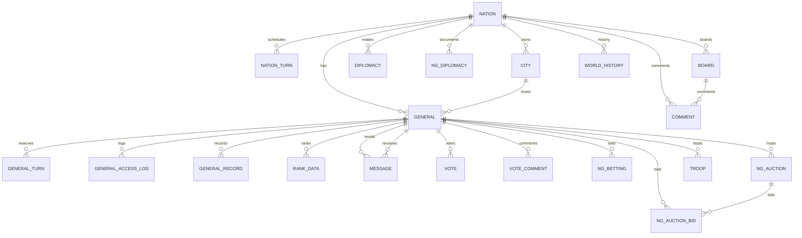

# Legacy Entities Overview

This document summarizes the primary entities in the legacy engine, how they
interact, and where their state lives. The active runtime lives in
`legacy/hwe/sammo/` and uses the tables in `legacy/hwe/sql/schema.sql`.

## Data Sources

- Table name map: `legacy/hwe/sammo/Enums/TableName.php`
- Schema definitions: `legacy/hwe/sql/schema.sql`

## Coverage Notes

- The legacy runtime mixes active, archived, and transitional tables.
- Table relationships are mostly enforced in code; few explicit FK constraints.
- Some tables are retained for history or migration and may not be touched in
  the current runtime path.

## Core Entities

### General (장수)

- Class: `legacy/hwe/sammo/General.php` (base: `legacy/hwe/sammo/GeneralBase.php`)
- Tables: `general`, `general_turn`, `rank_data`, `general_access_log`
- Interaction highlights:
  - Command execution: `legacy/hwe/sammo/Command/*` and
    `legacy/hwe/sammo/TurnExecutionHelper.php`
  - Turn reservation: `legacy/hwe/sammo/LastTurn.php`
  - Combat adapter: `legacy/hwe/sammo/WarUnitGeneral.php`
  - Modifiers/triggers via `iAction` modules (items, specials, traits)
  - Logging: `legacy/hwe/sammo/ActionLogger.php`
- DB fields (schema):
  - `general`: no, owner, npcmsg, npc, npc_org, affinity, bornyear, deadyear,
    newmsg, picture, imgsvr, name, owner_name, nation, city, troop, leadership,
    leadership_exp, strength, strength_exp, intel, intel_exp, injury,
    experience, dedication, dex1, dex2, dex3, dex4, dex5, officer_level,
    officer_city, permission, gold, rice, crew, crewtype, train, atmos, weapon,
    book, horse, item, turntime, recent_war, makelimit, killturn, block,
    dedlevel, explevel, age, startage, belong, betray, personal, special,
    specage, special2, specage2, defence_train, tnmt, myset, tournament,
    newvote, last_turn, aux, penalty
  - `general_turn`: id, general_id, turn_idx, action, arg, brief
  - `general_access_log`: id, general_id, user_id, last_refresh, refresh,
    refresh_total, refresh_score, refresh_score_total
  - `rank_data`: id, nation_id, general_id, type, value
  - JSON columns: `general.last_turn`, `general.aux`, `general.penalty`

### Nation (국가)

- Data rows: `nation`, `nation_env`, `nation_turn`
- Nation-type actions: `legacy/hwe/sammo/ActionNationType/*`,
  base in `legacy/hwe/sammo/BaseNation.php`
- Interaction highlights:
  - Nation commands: `legacy/hwe/sammo/Command/Nation/*`
  - Diplomacy: `diplomacy`, `ng_diplomacy`, and
    `legacy/hwe/sammo/DiplomaticMessage.php`
  - Monthly economy updates: `legacy/hwe/sammo/Event/Action/*`
- DB fields (schema):
  - `nation`: nation, name, color, capital, capset, gennum, gold, rice, bill,
    rate, rate_tmp, secretlimit, chief_set, scout, war, strategic_cmd_limit,
    surlimit, tech, power, spy, level, type, aux
  - `nation_turn`: id, nation_id, officer_level, turn_idx, action, arg, brief
  - `nation_env`: id, namespace, key, value
  - JSON columns: `nation.spy`, `nation.aux`, `nation_turn.arg`,
    `nation_env.value`

### City (도시)

- Data rows: `city`
- Static map data: `legacy/hwe/sammo/CityConstBase.php`,
  `legacy/hwe/sammo/CityInitialDetail.php`
- Live cache: `legacy/hwe/sammo/CityHelper.php`
- Interaction highlights:
  - Supply and isolation updates via `Event/Action/UpdateCitySupply`
  - Conquest/war defender: `legacy/hwe/sammo/WarUnitCity.php`
- DB fields (schema):
  - `city`: city, name, level, nation, supply, front, pop, pop_max, agri,
    agri_max, comm, comm_max, secu, secu_max, trust, trade, dead, def, def_max,
    wall, wall_max, officer_set, state, region, term, conflict
  - JSON columns: `city.conflict`

### Troop (부대)

- Data rows: `troop`
- Interaction highlights:
  - Join/leave flows in `legacy/hwe/sammo/API/Troop/*`
  - Static event hooks from `legacy/hwe/sammo/StaticEvent/*`
- DB fields (schema):
  - `troop`: troop_leader, nation, name

### Command / Turn (턴 예약과 실행)

- Turn snapshots: `legacy/hwe/sammo/LastTurn.php`
- General commands: `legacy/hwe/sammo/Command/General/*`
- Nation commands: `legacy/hwe/sammo/Command/Nation/*`
- Execution entry: `legacy/hwe/sammo/TurnExecutionHelper.php` and
  `legacy/hwe/proc.php`
- DB fields (schema):
  - `general_turn`: id, general_id, turn_idx, action, arg, brief
  - `nation_turn`: id, nation_id, officer_level, turn_idx, action, arg, brief

### War Units (전투 단위)

- Base: `legacy/hwe/sammo/WarUnit.php`
- General combat: `legacy/hwe/sammo/WarUnitGeneral.php`
- City combat: `legacy/hwe/sammo/WarUnitCity.php`
- Interaction highlights:
  - Battle flow and resolution: `legacy/hwe/process_war.php`
  - Uses General/Nation/City snapshots for deterministic resolution

## Rule Modules and Modifiers

### iAction Modules

- Interface: `legacy/hwe/sammo/iAction.php`
- Modules:
  - Items: `legacy/hwe/sammo/ActionItem/*`
  - Domestic specials: `legacy/hwe/sammo/ActionSpecialDomestic/*`
  - War specials: `legacy/hwe/sammo/ActionSpecialWar/*`
  - Personalities: `legacy/hwe/sammo/ActionPersonality/*`
  - Nation types: `legacy/hwe/sammo/ActionNationType/*`
  - Crew types: `legacy/hwe/sammo/ActionCrewType/*`
  - Scenario effects: `legacy/hwe/sammo/ActionScenarioEffect/*`
- Applied by `General::getActionList()` and used by triggers, stat calculation,
  and combat phases.

### Trigger System

- Trigger callers: `legacy/hwe/sammo/TriggerCaller.php`,
  `legacy/hwe/sammo/GeneralTriggerCaller.php`,
  `legacy/hwe/sammo/WarUnitTriggerCaller.php`
- Trigger definitions: `legacy/hwe/sammo/GeneralTrigger/*`,
  `legacy/hwe/sammo/WarUnitTrigger/*`
- Used in pre-turn processing and battle phases.

### Constraints

- Validation rules: `legacy/hwe/sammo/Constraint/*`
- Command prechecks and selection logic use these constraints.

## System Entities

### Events

- Dynamic events: `event` table, executed by `legacy/hwe/sammo/Event/*`
- Static hooks: `legacy/hwe/sammo/StaticEvent/*`,
  wired via `GameConst::$staticEventHandlers`
- DB fields (schema):
  - `event`: id, target, priority, condition, action
  - JSON columns: `event.condition`, `event.action`

### Messaging and Diplomacy

- Messages: `legacy/hwe/sammo/Message.php`
- Targets: `legacy/hwe/sammo/MessageTarget.php`,
  `legacy/hwe/sammo/Target.php`
- Diplomacy wrapper: `legacy/hwe/sammo/DiplomaticMessage.php`
- Table: `message`
- DB fields (schema):
  - `message`: id, mailbox, type, src, dest, time, valid_until, message
  - `diplomacy`: no, me, you, state, term, dead, showing
  - `ng_diplomacy`: no, src_nation_id, dest_nation_id, prev_no, state,
    text_brief, text_detail, date, src_signer, dest_signer, aux
  - JSON columns: `message.message`, `ng_diplomacy.aux`

### Economy and World State

- Monthly updates: `legacy/hwe/sammo/Event/Action/ProcessIncome`,
  `ProcessSemiAnnual`, `ProcessWarIncome`
- Trade and supply: `RandomizeCityTradeRate`, `UpdateCitySupply`,
  `UpdateNationLevel`
- DB fields (schema):
  - `nation_env`: id, namespace, key, value
  - `statistic`: no, year, month, nation_count, nation_name, nation_hist,
    gen_count, personal_hist, special_hist, power_hist, crewtype, etc, aux
  - JSON columns: `statistic.aux`, `nation_env.value`

### Auctions, Betting, and Votes

- Auctions: `legacy/hwe/sammo/Auction.php` and `ng_auction*` tables
- Betting: `legacy/hwe/sammo/Betting.php` and `ng_betting`
- Votes and tournaments: `vote`, `vote_comment`, `tournament`
- DB fields (schema):
  - `ng_auction`: id, type, finished, target, host_general_id, req_resource,
    open_date, close_date, detail
  - `ng_auction_bid`: no, auction_id, owner, general_id, amount, date, aux
  - `ng_betting`: id, betting_id, general_id, user_id, betting_type, amount
  - `vote`: id, vote_id, general_id, nation_id, selection
  - `vote_comment`: id, vote_id, general_id, nation_id, general_name,
    nation_name, text, date
  - `tournament`: seq, no, npc, name, w, b, h, leadership, strength, intel, lvl,
    grp, grp_no, win, draw, lose, gl, prmt
  - JSON columns: `ng_auction.detail`, `ng_auction_bid.aux`, `ng_betting.betting_type`,
    `vote.selection`

### Logs and Records

- Action logs: `legacy/hwe/sammo/ActionLogger.php`
- User logs: `legacy/hwe/sammo/UserLogger.php`
- Tables: `ng_history`, `world_history`, `general_record`, `user_record`, `hall`
- DB fields (schema):
  - `ng_history`: no, server_id, year, month, map, global_history, global_action,
    nations
  - `world_history`: id, nation_id, year, month, text
  - `general_record`: id, general_id, log_type, year, month, text
  - `user_record`: id, user_id, server_id, log_type, year, month, date, text
  - `hall`: id, server_id, season, scenario, general_no, type, value, owner, aux
  - JSON columns: `ng_history.map`, `ng_history.global_history`,
    `ng_history.global_action`, `ng_history.nations`, `hall.aux`

### Boards, Locks, and Storage

- Boards/comments: `board`, `comment`
- Locks: `plock`
- KV stores: `storage`, `nation_env`
- DB fields (schema):
  - `board`: no, nation_no, is_secret, date, general_no, author, author_icon,
    title, text
  - `comment`: no, nation_no, is_secret, date, document_no, general_no, author,
    text
  - `plock`: no, type, plock, locktime
  - `storage`: id, namespace, key, value
  - JSON columns: `storage.value`

### Archive and Lifecycle Tables

- Archive/season data: `ng_games`, `ng_old_nations`, `ng_old_generals`,
  `emperior`
- Scheduling: `reserved_open`
- Selection pools: `select_npc_token`, `select_pool`
- Inheritance: `inheritance_result`
- DB fields (schema):
  - `ng_games`: id, server_id, date, winner_nation, map, season, scenario,
    scenario_name, env
  - `ng_old_nations`: id, server_id, nation, data, date
  - `ng_old_generals`: id, server_id, general_no, owner, name, last_yearmonth,
    turntime, data
  - `emperior`: no, server_id, phase, nation_count, nation_name, nation_hist,
    gen_count, personal_hist, special_hist, name, type, color, year, month,
    power, gennum, citynum, pop, poprate, gold, rice, l12name, l12pic, l11name,
    l11pic, l10name, l10pic, l9name, l9pic, l8name, l8pic, l7name, l7pic,
    l6name, l6pic, l5name, l5pic, tiger, eagle, gen, history, aux
  - `reserved_open`: id, options, date
  - `select_npc_token`: id, owner, valid_until, pick_more_from, pick_result,
    nonce
  - `select_pool`: id, unique_name, owner, general_id, reserved_until, info
  - `inheritance_result`: id, server_id, owner, general_id, year, month, value
  - JSON columns: `ng_games.env`, `ng_old_nations.data`, `ng_old_generals.data`,
    `emperior.history`, `emperior.aux`, `reserved_open.options`,
    `select_npc_token.pick_result`, `inheritance_result.value`

## Aux and JSON Payloads

Legacy data uses many JSON fields with dynamic keys. Most are updated in code,
not enforced by DB constraints.

### General `aux`

- Storage layer: `legacy/hwe/sammo/LazyVarAndAuxUpdater.php`
- Access pattern: `getAuxVar()` / `setAuxVar()` on `General`
- Literal keys observed in code (not exhaustive):
  - `armType`, `autorun_limit`, `inheritBuff`, `inheritRandomUnique`,
    `inheritResetSpecialWar`, `inheritResetTurnTime`,
    `inheritSpecificSpecialWar`, `last발령`, `max_domestic_critical`,
    `movingTargetCityID`, `nextTurnTimeBase`, `pickYearMonth`,
    `use_auto_nation_turn`, `use_treatment`
- Key sources:
  - Turn execution timing: `legacy/hwe/sammo/TurnExecutionHelper.php`
  - AI state and movement: `legacy/hwe/sammo/GeneralAI.php`
  - Inheritance actions: `legacy/hwe/sammo/API/InheritAction/*`
  - Domestic critical resets: `legacy/hwe/sammo/Command/General/*`
  - Troop dispatch markers: `legacy/hwe/sammo/Command/Nation/che_발령.php`
- Item or trigger-specific keys are stored via constants (e.g.
  `ActionItem/event_충차.php`, `WarUnitTrigger/event_충차아이템소모.php`) and are
  not visible in literal scans.

### Nation `aux`

- Enum keys: `legacy/hwe/sammo/Enums/NationAuxKey.php`
  - `can_국기변경`, `can_국호변경`, `did_특성초토화`, `can_무작위수도이전`,
    `can_대검병사용`, `can_극병사용`, `can_화시병사용`, `can_원융노병사용`,
    `can_산저병사용`, `can_상병사용`, `can_음귀병사용`, `can_무희사용`,
    `can_화륜차사용`
- Used by constraints and nation commands, especially unit unlock logic.

### Other JSON Columns

- `city.conflict`: siege contribution map keyed by nation id.
- `message.message`: serialized message payload including targets/options.
- `event.condition` / `event.action`: JSON DSL for event dispatch.
- `storage.value` / `nation_env.value`: key-value JSON via `KVStorage`
  (`legacy/src/sammo/KVStorage.php`), used for `game_env`, `nation_env`,
  `betting`, `vote`, `inheritance_*`, and other namespaces.
- Large history blobs: `ng_history.*`, `ng_old_nations.data`,
  `ng_old_generals.data`, `emperior.history`, `emperior.aux`.

### KVStorage `game_env` Namespace

`game_env` is stored in `storage` with `namespace = 'game_env'` and is the
primary server-wide runtime state store. Keys are read/written in core
functions and APIs (e.g. `legacy/hwe/func.php`,
`legacy/hwe/func_time_event.php`, `legacy/hwe/sammo/TurnExecutionHelper.php`).

Observed literal keys (from code reads/writes, non-exhaustive):

- Time and turn: `startyear`, `year`, `month`, `init_year`, `init_month`,
  `starttime`, `opentime`, `turntime`, `turnterm`
- Scenario and season: `scenario`, `scenario_text`, `season`
- Join and creation gates: `join_mode`, `maxgeneral`, `block_general_create`,
  `show_img_level`, `icon_path`, `extended_general`
- Global flags and limits: `isunited`, `fiction`, `autorun_user`, `killturn`,
  `refresh`, `maxrefresh`, `refreshLimit`, `maxonline`, `recentTraffic`,
  `online_user_cnt`, `online_nation`, `server_cnt`, `msg`
- NPC policy: `npcmode`, `npc_nation_policy`, `npc_general_policy`
- Tournament and voting: `tournament`, `phase`, `tnmt_type`, `tnmt_time`,
  `tnmt_auto`, `tnmt_msg`, `tnmt_trig`, `tnmt_pattern`, `develcost`,
  `last_tournament_betting_id`, `lastVote`
- Scout restrictions: `block_change_scout`
- Auctions: `obfuscatedNamePool`

Notes:

- Some keys are used as feature toggles (e.g. `block_change_scout`,
  `block_general_create`) while others carry time/season state.
- Additional keys may exist via dynamic or computed names outside literal
  scans, especially in admin or migration scripts.

## Table Usage Index (Partial)

This index focuses on primary runtime touch points and omits view-only pages.

- `general`: `legacy/hwe/sammo/General.php`, `legacy/hwe/sammo/GeneralAI.php`,
  `legacy/hwe/sammo/TurnExecutionHelper.php`
- `general_turn`: `legacy/hwe/sammo/TurnExecutionHelper.php`,
  `legacy/hwe/sammo/API/Command/GetReservedCommand.php`
- `general_access_log`: `legacy/hwe/sammo/General.php`,
  `legacy/hwe/sammo/API/General/GetFrontInfo.php`
- `rank_data`: `legacy/hwe/sammo/General.php`, `legacy/hwe/sammo/WarUnitGeneral.php`
- `nation`: `legacy/hwe/sammo/Command/Nation/*`,
  `legacy/hwe/sammo/Scenario/Nation.php`
- `nation_turn`: `legacy/hwe/sammo/TurnExecutionHelper.php`,
  `legacy/hwe/sammo/API/NationCommand/GetReservedCommand.php`
- `nation_env`: `legacy/src/sammo/KVStorage.php`,
  `legacy/hwe/sammo/Command/NationCommand.php`
- `city`: `legacy/hwe/sammo/CityHelper.php`,
  `legacy/hwe/sammo/WarUnitCity.php`, `legacy/hwe/process_war.php`
- `troop`: `legacy/hwe/sammo/API/Troop/*`,
  `legacy/hwe/sammo/StaticEvent/*`
- `diplomacy`, `ng_diplomacy`: `legacy/hwe/sammo/DiplomaticMessage.php`,
  `legacy/hwe/sammo/API/Global/GetDiplomacy.php`
- `message`: `legacy/hwe/sammo/Message.php`,
  `legacy/hwe/sammo/API/Message/*`
- `event`: `legacy/hwe/sammo/TurnExecutionHelper.php`,
  `legacy/hwe/sammo/Event/*`
- `board`, `comment`: `legacy/hwe/v_board.php`,
  `legacy/hwe/j_board_get_articles.php`
- `ng_auction`, `ng_auction_bid`: `legacy/hwe/sammo/Auction.php`,
  `legacy/hwe/sammo/API/Auction/*`
- `ng_betting`: `legacy/hwe/sammo/Betting.php`,
  `legacy/hwe/sammo/API/Betting/*`
- `vote`, `vote_comment`: `legacy/hwe/sammo/API/Vote/*`,
  `legacy/hwe/v_vote.php`
- `ng_history`, `world_history`: `legacy/hwe/sammo/ActionLogger.php`,
  `legacy/hwe/func_history.php`
- `general_record`: `legacy/hwe/sammo/ActionLogger.php`
- `user_record`: `legacy/hwe/sammo/UserLogger.php`
- `storage`: `legacy/src/sammo/KVStorage.php`,
  `legacy/hwe/sammo/ResetHelper.php`
- `ng_games`, `ng_old_nations`, `ng_old_generals`, `emperior`:
  `legacy/hwe/sammo/ResetHelper.php`, `legacy/hwe/a_emperior.php`

## Interaction Sketch

- Turn execution (`TurnExecutionHelper`):
  - Reads `general_turn` / `nation_turn`
  - Builds General/Nation/City context
  - Applies constraints → runs command → triggers → logs
  - Runs monthly events and world updates
- Battle (`process_war.php`):
  - Builds `WarUnitGeneral` and `WarUnitCity`
  - Resolves phases and damage with triggers
  - Applies city conquest and nation collapse rules
- Diplomacy:
  - `Message` delivers a diplomacy request
  - `DiplomaticMessage` accepts/rejects
  - Nation command executes and updates diplomacy tables

## Entity Relationships (Mermaid ERD)

Note: `message.src` / `message.dest` are polymorphic in practice (general or
nation depending on message type). The diagram below treats them as general
links for simplicity.

## Related Docs

- `docs/architecture/legacy-engine.md`
- `docs/architecture/legacy-engine-general.md`
- `docs/architecture/legacy-engine-war.md`
- `docs/architecture/legacy-engine-economy.md`
- `docs/architecture/legacy-engine-diplomacy.md`
- `docs/architecture/legacy-engine-events.md`
