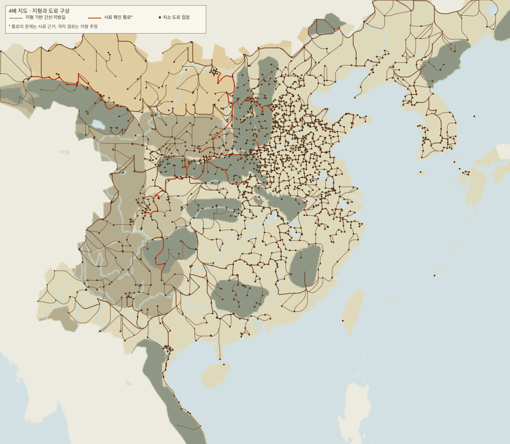

# 좁은 구역·포위 구역·성 작은 기호와 육로망 개편

## 결정과 지도 판

- 기존 768×669 세계의 화면 범위와 행군 거리를 유지하면서 격자를 3072×2676으로 정밀화한다. 모든 縣의 치소 이동·최대 7×7 증축 공간을 선확보한다. 부족하다고 게임 중 점령·행정 경계를 자동 이전하지 않는다.
- 목재 생산의 면적은 세부 격자 16칸을 기존 게임 격자 1칸으로 환산한다. 지도 해상도 때문에 전 세계 월 생산량이 197,460에서 3,159,360으로 늘어나는 문제를 막고 기존 값을 유지한다.
- 郡 경계는 필요한 칸만 조정하고 縣의 郡 소속은 유지한다. 우산국·일대국의 해안도 국소 조정한다.
- 옛 1447 릴리스 번들은 보존하고 `han-world-v3-1447-map4` 새 판을 만든다. 먼 줌 성은 픽셀, 가까운 줌 성은 그림으로 그린다. 최대 확대 때 세부 격자 한 칸은 16px이다. 작은 성 기호 경로는 제거했다.

## 지형 감사 결과

`tools/map/audit_province_clearance.py --json --check`가 새 지도의 전체 省 1,627곳과 게임 성 1,447곳을 검사한다.

| 항목 | 시작 실측 | 새 지도 |
|---|---:|---:|
| 현재 성 그림에 비해 좁은 구역 | 415 | 0 |
| 최대 7×7 증축 공간이 없는 성 | 원래 804곳이 49칸 미만 | 0 |
| 省 기준 완전 포위 구역 | 41 | 0 |
| 관할 단위 완전 포위 구역 | 미측정 | 20 (미해결) |
| 전체 인접 그래프의 막다른 전략 거점 | 19 | 0 |
| 초기 개통 도로의 막다른 전략 거점 | 미측정 | 16 (미해결) |
| 가치 없는 빈 막다른 구역 | 25 | 0 |
| 꼭짓점으로만 닿는 구역 쌍 | 159 | 135 |

막다른 일반 성 구역 6곳(주애·우산국·주호·이주·유구·신소도)은 해안 또는 섬의 기존 성·항로·방어 가치를 `province-dead-end-dispositions-v1.json`에 기록했다. 근거 없는 바닷길은 만들지 않았다. 국소 경계 이전 15칸, 빈 막다른 구역 합침 25곳이다. 치소·거점 이전 253건은 `province-relocations-map4-v1.json`에 등급·전후 좌표·거리·전략 이유·이웃 변화를 기록했다(수 26·진 16·관 7·성 204; 기존 격자 거리 중앙값 1.41, 최댓값 19.92칸). 이동 그래프에서 길목이 새로 된 곳은 11곳이다. 현재도 이웃 쌍의 길목이 아닌 수·진·관은 각각 29·23·8곳이다. 길목 여부는 참고 측정이며 금지 게이트는 아니다. 관할 단위와 초기 개통 도로의 미해결 건은 `audit_province_clearance.py --check` 실패로 드러나며, 이 상태에서는 PR을 머지할 수 없다.

생성 규칙은 국소 절단의 7×7 중심, 공여 구역 연결성, 외부 탈출 경계를 요구한다. `provinceClearance.baseline.test.ts`는 Python 감사와 TypeScript 런타임 여유 칸을 전체 구역별로 대조한다. 좁은 띠·포위·막다른 거점 적색 입력도 검사한다.

## 육로·보루

- 지정된 건설 도로에서만 육지 행군을 허용한다. 도로가 없는 마른땅 접경은 도로 공사로 개척한다. 마른땅 연결이 없는 섬은 기존 검토된 해상 항로를 이용하거나 별도 근거 검토를 거친다.
- 4방향 마른땅 접경 후보 4,284개 중 초기 건설 도로는 2,201개, 개척 가능 도로는 2,071개, 두 현의 치소에서 접경까지 갈 수 없는 후보는 12개다. 마지막 12개는 공사 대상으로 제시하지 않는다. 본토 건설 도로는 하나의 연결 성분이다. 전체 육로 성분 9개 중 나머지는 주로 섬이다. 평지·구릉의 저비용 우회로 260개를 더 연결해 불필요한 막다른 길을 줄였다.
- 현 내부 길은 8방향 지형 비용 경로다. 대각선 양옆이 자기 현의 통과 지형일 때만 모서리를 지난다. 현 내부 하천 칸은 높은 비용으로 지나갈 수 있지만, 마른땅 접경 관문과 보루 칸은 그대로 엄격히 제한한다. 건설 도로의 양쪽 경로는 각 현의 단일 치소 출발점에 닿는다.
- 사료에서 이름을 확인한 통로 11개에 속하는 추정 간선 71개는 이동 가중치 700/1000을 쓴다. 통로의 존재와 정확한 격자 노선은 구분한다. 井陘道는 [史記 淮陰侯列傳](https://ctext.org/shiji/huai-yin-hou-lie-zhuan/zhs), 褒斜道는 [史記 河渠書](https://ctext.org/text.pl?if=en&node=64379&show=parallel), 金牛道·劍閣은 [三國志](https://ctext.org/sanguozhi/44/zh)와 [유적 연구](https://www.nature.com/articles/s40494-024-01155-y) 등을 참고했다. 전체 출처는 `build_han_land_roads.py`의 통로 원장에 있다. 나머지는 지형으로 설계한 게임 도로다.
- 전체 줌에서도 건설된 지방길을 연하게 함께 그려 간선 사이의 연결이 보인다. 주요 간선 656개와 역사 통로를 강조하며, 치소와 성이 없는 구역의 도로 접점은 점으로 나타낸다. 곡선은 표시만 부드럽게 한 것이며 통행 판정은 원본 격자다.
- 도로 경계 옆 보루는 별도 소유자·주둔·성벽·포위 상태를 갖는다. 적대 세력의 보루는 그 도로를 막으며, 인접 군단이 별도 공성 명령으로 점령해야 열린다. 공성은 세 번의 유지된 턴 경계를 요구한다. 도로 공사·보루 건설·공성 명령과 저장·API 읽기를 연결했다.

초기 최소 연결망의 끊겨 보이는 잎길을 줄이기 위해 지형 비용이 8 이하인 우회 접경을 추가했고, 모든 초기 도로의 양 끝 접점을 표시했다. 1,627개 구역 가운데 성이 없는 180곳도 도로가 통과할 수 있으므로, 치소 그림만 찍으면 그 구역의 연결이 끊긴 것처럼 보인다. 본토 연결성은 간선 그래프에서 확인하고, 섬은 육상 연결 여부와 해상 항로를 별도로 판정한다.

전체 지형은 `assets/map4-overview.png`, 건업 부근 최대 확대는 `assets/map4-geonyeop-max-zoom.png`에 있다.

실제 `HanMapCanvas`를 로컬 브라우저에서 새 정본 지형·도로·1,447 城으로 띄운 검증 캡처는 `assets/map4-browser-far.png`, `assets/map4-browser-mid.png`, `assets/map4-browser-max.png`에 있다. 확대 최대치는 셀당 16px이며, 이때 1,447개 성 모두 그림 경로(`citySprites=1447`, `cityPixels=0`)였다. 가장 먼 줌은 픽셀 1,445개·그림 2개였고 `cityGlyphs=0`이다. 중앙 `elementFromPoint=CANVAS`, 휠·드래그 전후 캔버스 픽셀 변화, 브라우저 오류 0건을 `assets/map4-browser-verification.json`에 기록했다. 무위군 현미(647), 주천군 연수(771), 한중군 면양(598), 재동(587), 요동군(730), 검각(1047), 우산국(1104), 일대국(1120), 건업(934)은 `assets/map4-browser-city-<id>.png`에 개별 캡처했다. 이 로컬 캔버스 하네스는 실제 렌더러를 사용하지만 로그인·메인·휘하 화면의 서버 연동 자체를 대체하지는 않는다.

## 초기 검증 현황 (2026-09-24)

- 통과: 전체 구역 여유 칸 측정, 도로 단위 검사, 새 번들 재생성과 해시 대조, web/shared·web/game 타입 검사, JVM 컴파일. `audit_province_clearance.py --check`는 관할 포위 20곳과 초기 개통 도로 막다른 거점 16곳으로 실패한다.
- 통과: web/shared Vitest 141건, web/game Vitest 779건, web/gateway Vitest 263건과 세 패키지 타입 검사. 지도 Python 대상 테스트 67건(의도된 skip 1건). 대상 game-api JVM 테스트 93건, 대상 infra JVM 테스트 15건, V2 운송 회귀 테스트.
- 통과: `HanWorldArtifactsResolverTest`, `HanRuntimeConstantsIntegrityTest`, `MapStrategicTopologyControllerTest`, `HwihaDeployPrecheckServiceTest`, `HwihaRoadFortStateTest`, `HwihaDomesticInputTest` 대상 JVM 테스트.
- 통과: `audit_territory_disconnections.py --check`가 재귀 단계 검사 뒤 이탈 조각 124건 모두에 기존 검토 판정을 이어 붙였다. 새 판에서 새로 생긴 미심의 조각은 0건이다. 판정은 외부 세력 45·격자 결함 47·역사적 비지 8·부모 귀속 오류 8·물길 분리 16건이다.
- 통과: 한 지도 보급 불일치 감사(`mismatches=250 errors=0`), 시나리오 시작 보급 감사(`errors=0`), 郡 보급 연결 산출물 대조, map4 번들 카탈로그의 15개 blob 해시 대조.
- 통과: 시나리오 Python 테스트 430건(의도된 skip 1건). 실제 지도 캔버스의 브라우저 조작·멀리/중간/최대 확대와 위 9곳 캡처.
- infra 전체 검사에서는 모든 역사 판을 동시에 보관하고 4배 지형 JSON을 다시 통째로 읽는 테스트가 512MiB 테스트 JVM 힙에서 OOM을 냈다. 판별에 필요한 필드만 스트리밍하고 판별기를 판마다 새로 만들도록 변경했다. 해당 `HanAdministrativeCountyTest` 재실행은 통과했으며 PR 전체 CI 결과를 다시 확인한다.
- CI 실패 보고서로 남은 생산량 합계 1건을 확인해 세부 격자 면적을 기준 게임 격자 면적으로 환산했다. 철·말 생산량은 그대로다. 실패 시 JVM 테스트 XML을 보존하도록 CI를 보강했다.
- 후속 리뷰 CI(run `36090551096`)에서 `contracts`는 관할 포위 20곳과 개통 도로 막다른 거점 16곳으로 실패했다. `jvm-core`의 새 시드 테스트는 map4와 핀 없는 옛 판을 혼동한 기대값을 수정했다. `game-engine`의 S3 고리 테스트도 같은 핀 불일치를 고쳐 실제 map4 경로까지 진행했으나, 성 77에서 `MilitarySupplyUnavailableException`으로 실패했다. 이미 끊긴 공간 보급과 군사 차단 효과의 판정 계약을 해결해야 한다.
- 고정 성 수를 합격 조건으로 삼던 테스트는 제거하고 지도 원장의 성·관할 ID, 저장 위상 핀, 메타데이터와 실제 자료의 일치 여부를 검사하도록 바꿨다.
- 격리된 세 제품 화면의 서버 연동 캡처는 아직 하지 못했다. 로컬 디스크 여유 3.6GiB로 6개 Docker 이미지의 새 빌드를 시작하기 어려워, 동일 컴포넌트의 로컬 브라우저 검증으로 화면 동작을 확인했다. PR CI와 infra 전체 테스트는 진행 중이다.

## 운영 위험

- 새 지도 판은 새 세계에서만 보인다. 라이브 pep 세계 변경에는 별도 리셋 승인이 필요하다. 휘하 컷오버 PR #898과 리셋의 순서도 따로 정해야 한다. 이 작업에서는 리셋·main 머지를 하지 않는다.
- 역사 통로의 정확한 칸별 노선은 사료로 확증되지 않았다. 새 나루·도하를 근거 없이 활성화하지 않는다.
- 보루 공성은 독립 점령·3턴 압박·주둔 요건의 첫 판이다. 성벽 피해·보급 차단·NPC의 능동 공성은 현재 포함하지 않는다.
- map4에서 기존 도로망이 끊은 성에 군사 차단까지 걸릴 때 보급 판정이 `MilitarySupplyUnavailableException`으로 중단된다. 보급 규칙과 도로 연결성을 함께 정리하기 전까지 새 지도 판을 머지하지 않는다.

## 2026-09-25 재리뷰 반영

- #905 재리뷰의 기존 판 도로 공사 회귀를 수정했다. 전략 도로 접경이 없는 판에서는 대상 없는 `ROAD`를 현 단위 공사로 접수하고, 접경이 있는 지도에서는 접경 ID를 요구한다. 대상 ID를 임의로 붙인 옛 판 공사는 거절한다.
- 보루·도로 접경 공사의 완공 기록을 현 단위 공사와 접경 ID로 구분했다. 전략 공사는 현 상업·방어·성벽 수치의 일회성 완공 보너스를 받지 않는다. 성방 감축은 현 성방 기록만 제거하며 보루는 남긴다. 사용자 규칙은 `docs/user/features.md`에 맞췄다.
- 공사 응답에 현의 전체 관할 구역 ID와 완공 접경 ID를 싣고, 화면의 도로·보루 선택지와 감축 버튼에 적용했다. `game_env`의 전략 상태 읽기는 공통 코드로 모았고, 새로 열린 도로가 지도 API에 보이는 테스트를 더했다.
- 사용자 요청에 따라 고정된 성·현·거점 수 단언은 다시 넣지 않았다. 대신 변경된 화면 이름 전체의 ID·표기 쌍 SHA-256과 대표 행정 단위 표기, 완공 효과·감축 권한을 검증한다.
- 로컬 통과: `HwihaInfrastructureSiteRulesTest`, `HwihaDomesticEffectsTest`, `HwihaDomesticRulesTest`, `MapStrategicTopologyControllerTest`, game-engine Kotlin 컴파일, web/game 타입 검사, web/shared `cityName.test.ts` 23건.
- 아직 미해결: 관할 포위 20곳, 초기 개통 도로 막다른 전략 거점 16곳, S3의 성 77 보급·차단 계약. PR은 초록 CI가 될 때까지 draft로 둔다. 로그인한 실제 화면에서 도로·보루 선택 동작은 아직 재검증하지 않았다.

## 2026-09-25 지형·보급 연결 보정

- 전략 거점의 마른땅 출구를 서로 다른 관할 구역으로 연결하고, 단일 치소에서 닿는 접경만 초기 도로 후보로 사용했다. 좁은 목과 나루의 위치 변경은 `strategic-site-province-carves-v1.json`과 `province-relocations-map4-v1.json`에 기록했다. 한진 나루는 沔水 동쪽 둑에 유지했다.
- 같은 郡 안에서 저비용 접경 도로의 연결 성분을 이어 보급망이 외부 우회로에만 의존하지 않게 했다. 전략 거점의 사용 가능한 두 번째 출구도 초기 개통했다. 사용자 결정 C에 따라 15개 시나리오의 중립 城까지 런타임과 같은 관할 소유권으로 계산해 필요한 초기 도로 51개를 추가했다. 현재 도로 원장은 후보 4,291개, 초기 개통 2,367개, 공사 가능 1,913개, 접근 불가 11개다. 활성 해상 항로가 있는 거점은 실제 런타임 출구로 집계한다. 새 항로는 만들지 않았다.
- `audit_province_clearance.py --check` 결과: 성 1,447곳, 구역 1,627곳, 좁은 구역 0, 증축 공간 부족 0, 구역 포위 0, 관할 포위 0, 전략 거점 막다른 길 0, 초기 개통 경로상 전략 거점 막다른 길 0, 빈 막다른 구역 0. 해안·섬의 일반 성 막다른 구역 6곳은 기존 검토 판정대로다.
- 지도·도로·물길·세계·시나리오 파생물을 재생성하고 map4 번들 및 런타임 해시 핀을 갱신했다. 시나리오 #990002의 위상 핀을 새 지도와 맞췄다. 성 77의 수도 연결 보급 경로는 새 초기 도로망에서 확인했다. 실제 S3 JVM 통합 실행은 로컬 Docker의 Redis 컨테이너 생성 500 오류로 아직 확인하지 못했으며 PR CI에서 확인해야 한다.
- 성 수를 합격 기준으로 검사하는 단언은 복구하지 않았다. 지도 원장 일치, 전략 거점 연결성, 생성물 해시를 검증한다. 후보 거점과 합성 치소의 이동은 게임 지도 배치 판단이며 역사적 정확도 확증은 아니다.

## 사용자 결정 C: 초기 보급 절단 제거

- 도로의 BUILT 상태가 실제 보급 경로를 정한다. 15개 시나리오 각각에서 이전 인접 그래프의 보급 가능 城 집합과 비교해 `before - after = ∅`을 검사한다. 같은 검사에서 임의의 해시 고정 절단 목록을 쓰지 않는다. 초기 도로 하나를 닫아 불변식이 실패하는 반례도 확인했다.
- 잠현(1466)은 합성 위치가 육안현(43138)의 치소에서 떨어진 조각에 놓여, 접경을 도로로 바꿔도 내부 길이 이어지지 않았다. 사료 위치 주장 없이 같은 여강군의 치소 연결 지형으로 합성 배치를 옮겼다. 새 잠현과 육안현 사이에는 치소에서 이어진 마른땅 접경 20칸이 있고 도로가 BUILT로 생성된다.
- 지역 분리 목록 124행 가운데 이 이동으로 바뀐 것은 육안현 떨어진 조각과 여강군 조각 두 행뿐이다. 두 조각의 기준점과 외부 접경, 기존 판정은 유지된다. 새 칸 수·구성원에 맞춰 map4 심사 원장의 전체 목록 해시를 갱신했다.
- 감사의 적색 반례로 관할 완전 포위 행 하나를 임시 입력에 넣었을 때 `audit_province_clearance.py --check`가 종료 코드 1과 `jurisdictionFullyEnclosed=1`을 냈다.
- `HanStrategicSupplyProviderTest`의 15개 시나리오 검사와 도로 폐쇄 반례, 지도 여유·막다른 길 감사, 지도 단위 검사 7개, 관련 infra 테스트가 통과했다. 지역 분리 원장은 124개 조각 모두 판정이 유지되며 검사에 통과했다. PR 전체 CI와 S3 통합 테스트는 새 커밋 푸시 뒤 확인한다.

## 2026-09-25 main 병합 충돌 처리

- main의 내정 모델·즉시 입력 봉투 이름 변경과 #905의 도로·보루 기능을 함께 적용했다. 보루 포위의 표시 이름을 명령 원장에 넣고, 삭제된 `legacyCommands` 필드는 제거했다.
- 선택 검사 통과: `HwihaInputRegistryTest`, `HwihaInfrastructureSiteRulesTest`, `HwihaDomesticEffectsTest`, `DomesticRulesTest`, `CommandReserveServiceTest`, `HwihaDomesticEngineTest`, `HanStrategicSupplyProviderTest`.
- `audit_province_clearance.py --check`는 관할 포위·전략 거점 막다른 길·런타임 도로 막다른 길 모두 0으로 통과했다. 전체 CI와 S3 통합 검사는 PR 업데이트 후 확인한다.

- 이어서 main의 #923·#925 내정 패키지 이동을 병합했다. 공사 상태의 접경 ID·칸 좌표 직렬화와 현 단위 완공 보너스 규칙을 새 `domestic` 타입에 유지했다. 재검증에서 로직의 입력·상태·효과·규칙·공사 자리 테스트, API 예약 테스트, 엔진 공사 및 15개 시나리오 보급 테스트가 통과했다. 지역 분리 감사도 124/124 판정 유지로 통과했다.

## 2026-09-25 제품 이름 규칙 게이트 대응

- #924 병합 뒤 `naming-lint`가 신규 도로·보루 타입의 `Hwiha` 접두사 때문에 실패했다. #905가 추가한 도로·보루·공사 자리·기록 타입과 파일을 도메인 이름으로 바꾸고, 새 엔진 보루 파일 3개를 `engine.siege`로 옮겼다. 기존 V60 Flyway 마이그레이션은 수정하지 않았다.
- 이름 검사 네 항목 모두 통과했다. 제품 식별자 기준은 11,075에서 10,939로, 제품 경로 기준은 550에서 547로 낮췄다. `test_naming_lint.py` 8건도 통과했다.
- 이름 변경 뒤 로직·API·엔진 관련 테스트, `HanStrategicSupplyProviderTest`, web/game 타입 검사와 Vitest 758건이 통과했다. 지도 기하·도로 데이터와 결정 C 보급 규칙은 변경하지 않았다.

- CI의 web(gateway) 테스트에서 서버 생성 시나리오 목록 로딩과 클릭 사이 경합을 확인했다. 서버 생성 버튼 활성화를 기다리는 테스트로 고쳤고 해당 파일 8건을 로컬에서 통과시켰다. 이는 관리 화면의 동작 변경 없이 비동기 준비 조건을 검증한다.

## 2026-09-25 결정 C 후속 보급·CI 수정

- CI의 S3 캠페인에서 성 864의 군사 차단 판정이 중단된 원인은 시작 영천 영토의 마른땅 인접망은 이어져 있지만 BUILT 도로가 성 864·1416을 수도에서 분리한 것이었다. 도로 생성기가 15개 공식 시나리오에 더해 S3 캠페인의 완전한 실시간 성 점유를 읽도록 했다. 이로써 `82455↔82976` 접경 도로 한 구간이 추가 개통되며 시작 보급 절단이 사라진다. 도로 폐쇄 적색 반례와 군사 차단 규칙은 유지한다.
- 공식 15개 시나리오와 S3의 `before - after = ∅`을 같은 JVM 테스트에서 검사한다. 고정된 성 수나 간선 수 대신 생성 원장의 ID 집합 및 인접 대칭성을 검증한다. 도로가 추가되어 map4 번들 카탈로그와 공간 위상 핀을 재생성했다.
- CI의 다른 실패는 부모 관할 조정 및 성 귀속 원장의 입력 해시 드리프트, map4 상수 원장의 이전 해시, 물 위상 테스트의 이전 타일 해시, 생산량 테스트의 이전 현 수 단언이었다. 원장 둘을 재생성하고 테스트를 현재 원장과 비교하도록 수정했다.
- 로컬 통과: `HanStrategicSupplyProviderTest`, `HanSpatialSupplyProviderTest`, `HanRuntimeConstantsIntegrityTest`, `HanStrategicTopologyJsonTest`, `HwihaCountyProductionJsonTest`, 부모 관할 원장 검사, 도로 생성물 검사, 성 귀속 원장 검사, 지도 여유·막다른 길 감사. 지도 감사 결과 전략 막다른 거점 0, 도로 기준 전략 막다른 거점 0, 완전 포위 관할 0이다. S3 전체 48순 통합 검증과 PR 전체 CI는 푸시 후 확인한다.
- 최신 main의 정찰·시야 도메인 이동을 병합하며 보루 점령 예약 명령과 새 정찰 입력 코덱을 함께 보존했다. 병합 후 이름 검사 기준은 제품 식별자 10,807건, 경로 543건으로 갱신했고 네 검사 모두 통과했다.
- 결합 검사에서 성 귀속 원장 재생성에 따른 `han-world-v3` manifest 해시 변경을 찾아 manifest와 map4 묶음·카탈로그 핀을 다시 생성했다. 고정된 이전 1447 묶음은 그대로 유지되며 자체 검사에 통과했다.
- map4 위상 해시 변경을 S3 캠페인 두 사본의 창고 위상 핀에도 적용했다. 두 JSON이 같은 내용을 담고 새 위상 핀을 가리키는지 확인했다.
- 푸시 직후 main에 #927 시야 원천 이동이 병합되어 생긴 충돌을 풀었다. 보루 통행 판정과 새 시야 원천 읽기 import를 함께 유지했다. 이름 검사 래칫은 병합 후 실측값인 식별자 10,767건·경로 541건으로 다시 내렸다.

## 2026-09-25 5차 리뷰의 Python 지도 게이트

- `test_han_tiles_contract`의 이전 타일 해시를 잠현 치소 이동 뒤 실제 map4 바이트 해시(`bc25b1af…`)로 옮겼다. 중복 지명 심사 입력의 추적 해시는 `route-node-selection-v1.json`의 현재 해시(`4030deb9…`)로 원장과 빌더 양쪽을 맞췄다. selection 파일의 변경은 `jurisdictionRouteClaims`·`reviewPolicy` 두 입력 해시뿐이며, 중복 판정 두 쌍(85168/87267, 42901/85581)의 행은 변하지 않았다. 이전 selection 해시 `5f0440cf…`는 동결 1447 catalog에만 남는다.
- 치소 위치 테스트의 고정 城 수·합격 수를 제거하고 `省 안 치소 ⇒ 같은 관할 ⇒ 같은 상위 구역` 관계와 예외 원장을 뺀 적색 반례로 검사한다. 옛 지도 커밋 `70ba97012`와 현행 타일을 동일 측정기로 비교하면 면적 있는 치소의 `trueCellInProvince`는 1,281→1,268이다. 17개 치소의 판정이 바뀌었고 15개는 자기 省에서 벗어나고 2개는 들어와 순감 13이다. `c883df02f`의 관할 출구·S3 지형 수정 뒤 1,267, `66e5d8bb3`의 잠현 치소 연결 뒤 1,268이다. 예외 원장을 적용한 Q1·Q1b 게이트는 0이고, 원장을 빼면 Q1이 양수로 실패한다.
- 행정 위상 원장의 `--check`는 통과했다. 이전 CI의 `20 != 0`은 명령 종료 코드가 아니라 테스트가 옛 `jurisdictionTopology.fullyEnclosedCount=20`을 기대한 실패였다. 현행 원장과 별도 지도 여유 감사 모두 완전 포위 관할 0이므로 테스트 기대를 0으로 바로잡았다. 물길 테스트의 변형은 물 칸으로 이동한 것이 아니라 등록된 거점 칸과 원장 칸이 달라지는 경우이므로 실제 검증 오류 문구를 검사하도록 이름과 기대를 수정했다.
- 새 CI의 S3 48순 통합 검사에서는 다음 실패가 성 77에서 났다. 초기 도로 연결은 이미 복구됐지만 전쟁 중 자국 도로가 끊겼을 때 판정기가 옛 지도 공간 오류 보호 규칙을 적용해 `MilitarySupplyUnavailableException`을 던졌다. 미개통 LAND 접경을 포함하는 지도는 개통 도로망의 절단을 실제 보급 절단으로 판정하도록 했다. 검토된 공간 오류 보호 행과 옛 지도 판정은 유지한다. 군사 차단이 동시에 있는 미개통 도로 적색 사례를 로직 테스트에 추가했다.
- 수정 뒤 S3 통합 경로는 48순과 포위·월말·재로드 검사를 모두 진행했고, 마지막 게임 상태 SHA만 이전 보급 결과와 달라졌다. 새 정규화 SHA를 기준선에 기록하고 같은 48순 검사를 다시 실행해 결정성을 확인한다.
- 동일 S3 48순 로컬 재실행은 새 SHA `473b3704…`로 통과했다. 종료 시 성 77은 여남 세력 소속이고 `supplyState=0`으로 확인됐으므로 통합 검사에 이 절단을 직접 단언했다. `MilitarySupplyReachabilityTest`도 옛 지리 결손 보호와 신규 미개통 도로 절단을 각각 확인하고 통과했다.
- 성 77의 직접 단언을 넣고 S3 48순을 다시 실행해 통과했다. 로직 단위 테스트와 지도·번들 생성물 검사, 이름 검사도 통과했다. CI와 같은 78개 Python 지도 테스트 파일은 진행 중이다.
- 이 수정 중 main에 #928 경제 이름 변경이 병합됐다. #905의 전략 도로·보루 공사 조건과 새 `CountyWarehouse`·`Resources` 타입을 함께 유지해 충돌을 풀었다. 새 경제 타입을 쓰는 로직·엔진 테스트 두 곳도 갱신했다. 이름 검사 기준은 병합 후 실측 식별자 10,280건·경로 537건으로 내렸다.

## 2026-09-25 6차 리뷰 반영

- 현행 map4 타일을 다시 측정해 면적 있는 치소 1,445곳 중 `trueCellInProvince` 1,268곳, `trueCellInJurisdiction` 1,277곳, `trueCellInParent` 1,415곳을 확인하고 치소 위치 테스트에 고정했다. 위 5차 기록의 1,281→1,268 변화는 재분할과 잠현 치소 연결의 결과다. 관할 귀속도 종전 1,290곳에서 1,277곳으로 바뀌었다. 省⇒관할⇒상위 관계 검사와 ID 중복 검사는 유지했다.
- 예외 원장 적용 시 `Q1: 0 / 1445`, `Q1b: 0 / 1445`, 원장을 빼면 `Q1: 168 / 1445`, 치소 좌표 변형 시 `Q1: 1 / 1445`로 게이트 출력을 고정했다. `test_measure_province_seat_offset` 10건이 통과했다.
- 도로 제약 지도에서 검토된 `UPHOLD` 행 없이도 공간 절단을 인정하는 보급 판정 예외를 KDoc에 명시했다. #928 병합 후 로컬 이름 래칫 실측값은 제품 식별자 10,277건이므로 기준선을 10,280에서 10,277로 내렸고 로컬 `naming_lint.py` 네 항목과 단위 테스트 8건이 통과했다.
- 직전 head의 CI `contracts`에서 전략 거점 승인 원장이 추적하는 `build_han_places.py` 해시가 낡아 테스트 2건이 실패했다. 5차 수정에서 바뀐 것은 중복 지명 심사의 입력 해시 상수 한 줄이며, 이 원장이 증언하는 투영 코드는 바뀌지 않았다. 원장의 파일 해시만 실제 SHA-256 `68800d02…`로 갱신했다. 다른 추적 입력 3개의 해시는 일치했다.
- 수정 후 전략 거점 승인 테스트 5건과 `validate_han_strategic_site_anchors.py --check`가 통과했다. 지도 계약 전체 테스트는 `test_relocate_han_province`의 긴 실행 중 중단해 전체 합격 여부를 확인하지 못했다. `check_han_tiles_coupled.py --check --include-slow`도 선행 10개 OK, 로컬 전용 CHGIS 검사 1개 SKIPPED까지 확인하고 중단했다. 뒤의 결합 항목은 미검증이다. 새 head의 GitHub CI 결과도 아직 없다.

## 2026-09-25 main 최신화 (#929·#930)

- #929의 월단평·기록 타입 이동과 #930의 로직 입력 타입·패키지 개명을 순서대로 병합했다. 충돌에서는 #905의 도로 개통, 보루 통행·포위, 보급 및 `CountyGeography.provincesOfCounty` 동작을 보존하고 현재 main의 중립 타입 이름을 사용했다. #930이 개명한 `MusterRules`, `TravelRules` 및 테스트에는 #905의 `LandPassageState` 변경이 이미 들어 있어 옛 경로의 중복 파일을 제거했다.
- 제품 식별자 이름 검사는 Python 3.12와 3.14가 같은 값을 세도록 ASCII 단어 경계로 고정했다. 현재 main의 기준 5,010건 대비 #905의 보루·화면 코드가 아직 main에 있는 `Hwiha*` 엔진·웹 타입을 새로 참조해 5,041건이다. 해당 타입의 중립 이름은 후속 코드 정리 브랜치에만 있으므로 이번 병합에서는 현행 컴파일 가능한 이름을 유지하고 임시 기준을 5,041건으로 기록했다. 그 브랜치를 main에 병합할 때 다시 낮춰야 한다.
- 증가 위치를 main과 파일별로 대조했다. 도로 보루 화면 `web/game/app/game/hwiha/siege/page.tsx` +7, 포위 서비스 `RoadFortSiegeService.kt` +5, 예약 실행기 `ReservedTurnHandler.kt` +5, 보루 읽기 `RoadFortReader.kt` +3, 내정 엔진 검사 +3, 내정 읽기 +2, 예약 서비스 +2, 보루 컨트롤러 +2, 포위 서비스 검사 +1, 수송 규칙 검사 +1, 이전 화면 `LastTurnPanel.tsx` −1로 순증 30건이다. 나머지 +1은 Python 버전별 Unicode 단어 경계 차이를 제거하면서 집계가 안정화된 값이다. 신규 보루 기능에서 기존 타입을 호출한 참조이며 후속 중립 이름 병합 뒤 5,010 이하로 되돌리는 책임을 남긴다.
- 병합 후 Kotlin 컴파일, 지도 결합 검사, 새 CI 결과는 진행 중이며 결과를 확인한 뒤 이 절에 기록한다.
